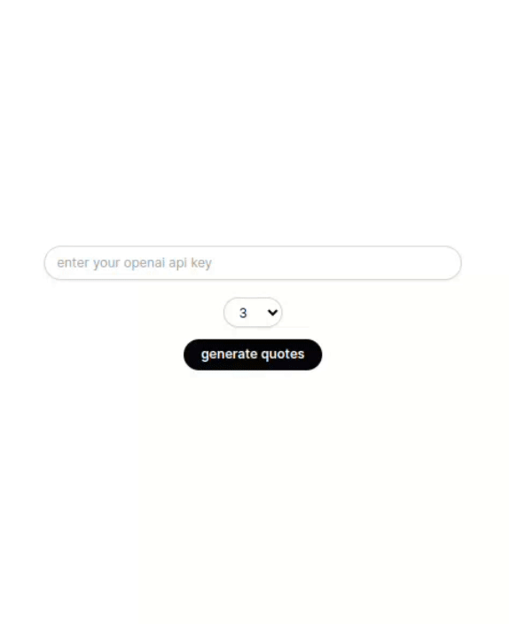

<<<<<<< HEAD
# quotes generator

this project generates inspirational quotes from silicon valley entrepreneurs using ai.

#### setup

1. clone the repository.
2. install dependencies with `pnpm install`.
3. run the development server with `pnpm run dev`.

### usage

1. go to the page and enter your openai api key.
2. select the number of quotes you want to generate.
3. click "generate quotes" to get your inspirational quotes.

### technologies used 

- next.js
- openai api
- vercel ai sdk

### deployment

to deploy the project, use platforms like vercel or netlify. simply push the repository to your preferred platform and follow their instructions.

### license

this project is open-source and available under the mit license.

---

=======
demo
>>>>>>> 91dc99a56bd640cbe1bee4a639f7005472a24f73
